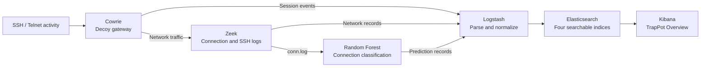

# TrapPot

**Turn attacker activity into evidence.**

TrapPot is an IoT honeypot system that captures SSH and Telnet activity, classifies network connections with a Random Forest model, and brings the results together in a Kibana dashboard. Explore the login attempts, the commands entered, the network activity, and the model's predictions.

Built by **Information Technology graduates from Qassim University** as a graduation project, TrapPot connects cybersecurity, applied machine learning, data engineering, and containerized deployment in one system.

**Cowrie · Zeek · Random Forest · Elasticsearch · Logstash · Kibana · Docker**

[Explore the architecture](#how-it-works) · [See the machine learning](#machine-learning-in-the-pipeline) · [Run the lab](#run-trappot) · [Try the demo scenarios](Trap-Pot/ATTACK_TESTS.md)

## Why TrapPot

A login attempt tells only part of the story. What credentials were tried? What happened after access? Which commands were entered, and what did the connection look like on the network?

Cowrie captures what visitors do inside the decoy. Zeek records how they connect. A Random Forest model adds a network classification. The ELK stack brings all three perspectives into a searchable investigation workflow, so you can study the behavior behind an event.

The project brings the full path into a local lab: **capture → process → classify → investigate**.

## What you can investigate

The included **TrapPot Overview** dashboard has **16 panels** spanning honeypot activity, network connections, model decisions, and guidance on reading the results.

| Question | What TrapPot surfaces |
| --- | --- |
| Who is connecting? | Top source IPs, session activity, and SSH/Telnet protocol mix. |
| What credentials are being tried? | Failed-login counts, attempted usernames, and credential combinations. |
| What happens after login? | Captured shell commands, successful logins, and file-upload events. |
| What does the traffic look like? | Zeek connection summaries and activity over time, with SSH metadata available through its own data view. |
| How does the model classify it? | Random Forest decisions, prediction counts, and service and connection-state breakdowns. |

Cowrie records upload metadata, including the filename, saved path, and hash, for inspection in Elasticsearch. The dashboard summarizes the activity; the underlying records preserve the detail.

## How it works



1. **Capture behavior.** Cowrie presents an emulated Linux gateway over SSH and Telnet. Its hostname, login banners, kernel identity, and decoy filesystem give sessions a device identity.
2. **Observe the network.** Zeek shares Cowrie's network namespace and watches its traffic directly, producing connection logs and SSH metadata alongside Cowrie's session events.
3. **Classify connections.** A Python detector reads Zeek's `conn.log`, prepares 12 features, and applies the bundled Random Forest model. It writes each prediction and its input features to a timestamped JSON record.
4. **Bring the evidence together.** Logstash parses four input streams into separate Elasticsearch indices. Kibana presents the activity and predictions through a dashboard provisioned at startup.

## Machine learning in the pipeline

**100 decision trees · 12 network features · 5 prediction classes**

The bundled scikit-learn `RandomForestClassifier` classifies individual network connections. Its inputs cover source and destination ports, duration, byte and packet counts, protocol, service, and connection state.

The model's output classes are:

`Normal` · `Scanning` · `Brute-force` · `Command Execution` · `Malware Download`

The [detector](Trap-Pot/ai_detector/detector.py) stores each prediction with its input features and timestamp, making the model's decisions available alongside the original security records.

**Observed behavior and model predictions remain separate.** Cowrie records session activity; the Random Forest classifies network connections. A login attempt or command remains visible regardless of the model's prediction. The [setup guide](docs/SETUP.md#verify-the-data-path) explains how to interpret the labels.

The repository includes the trained model, encoder, and inference pipeline. Training data, training code, and evaluation results are not published here.

## Engineering beyond the model

The integration is a central part of TrapPot: each component's output has to become useful input for the next.

- **A connected data pipeline.** Shared container volumes carry sensor logs into the detector and Logstash. Explicit field parsing, numeric conversion, timestamps, and index mappings make different event formats usable together.
- **Visibility when processing fails.** The detector reports row-processing exceptions to standard error and handles log rotation and truncation, addressing practical problems in a continuously running log pipeline.
- **Automated environment setup.** Docker Compose defines the services and their dependencies. Setup containers configure Elastic accounts, index templates, data views, and the dashboard.
- **Access control built into the lab.** Elasticsearch requires authentication and has no published host port. Logstash uses a dedicated writer account restricted to `trappot-*` indices, while Kibana has its own service account.
- **A demo that follows the data.** Documented SSH login, command, Telnet, and SFTP-upload scenarios connect a test action to the records and dashboard changes it should produce.

## Run TrapPot

The reference setup targets **Arch Linux with Docker Engine and Docker Compose**. See the [setup guide](docs/SETUP.md) for prerequisites, configuration, and troubleshooting.

Run this on an isolated lab host: the supplied configuration publishes the honeypot and Kibana ports on all host interfaces and includes demonstration credentials.

```sh
git clone https://github.com/bxrayxd/TrapPot.git
cd TrapPot/Trap-Pot
sudo sysctl -w vm.max_map_count=1048576
docker compose up --build -d
docker compose ps -a
```

Open [Kibana](http://localhost:5601), sign in with the default lab credentials **`elastic` / `trappotadmin`**, then open **Dashboards → TrapPot Overview**. Use **Last 24 hours** as the time range.

Try the [first SSH session](docs/SETUP.md#generate-your-first-session) or the [four demo scenarios](Trap-Pot/ATTACK_TESTS.md), then inspect the captured activity and RF network decisions. The [pipeline checks](docs/SETUP.md#verify-the-data-path) help you follow the records through each stage.

## Explore the implementation

| Area | Start here |
| --- | --- |
| Deployment and service setup | [Docker Compose](Trap-Pot/docker-compose.yml) |
| Honeypot identity and behavior | [Cowrie configuration](Trap-Pot/cowrie/etc/cowrie.cfg) · [Decoy filesystem](Trap-Pot/cowrie/honeyfs/) |
| Feature processing and inference | [Python detector](Trap-Pot/ai_detector/detector.py) · [Model artifacts](Trap-Pot/ai_detector/) |
| Log ingestion and event labels | [Logstash pipeline](Trap-Pot/logstash/pipeline/trappot.conf) |
| Searchable event schemas | [Elasticsearch templates](Trap-Pot/elasticsearch/templates/) |
| Dashboard and data views | [Kibana definitions](Trap-Pot/kibana/) |
| Running and demonstrating the system | [Setup guide](docs/SETUP.md) · [Demo scenarios](Trap-Pot/ATTACK_TESTS.md) |
